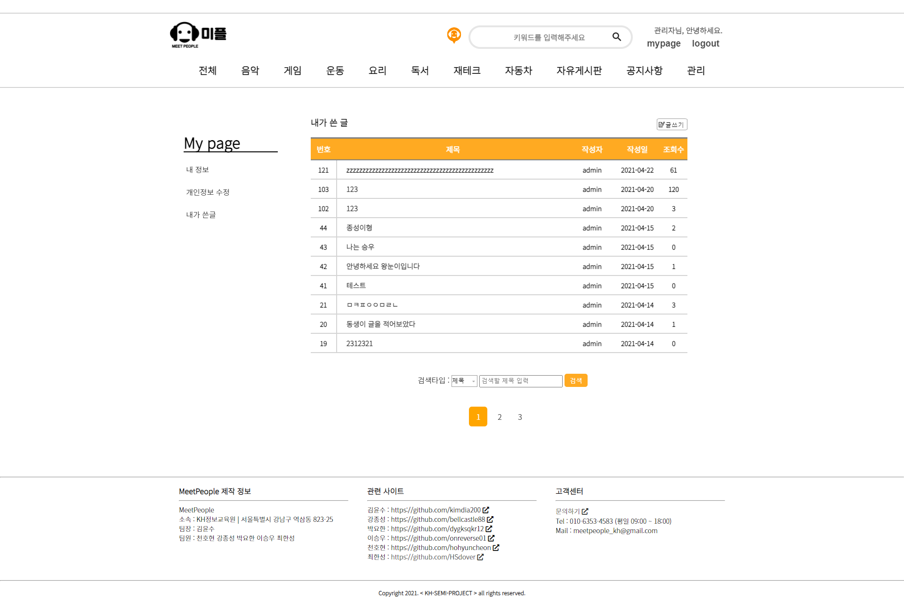

# KH-SEMI_Project(MeetPeople) 미플 (팀장)

## [미플 이동하기](http://meetpeople.kro.kr)

## [발표영상](https://youtu.be/bWKV1HDKZPQ)

## 1. 개요

- KH 교육원 과정중 세미 프로젝트로 진행함, 사용자들이 모임을 생성하고 참여하는 소셜 미팅 사이트
- 모임, 게시판, 댓글 등 커뮤니티 기능을 중점으로 진행한 프로젝트
- 회원가입, 로그인, 회원 관리등 부가 기능첨부
- 자바를 기반으로한 백엔드 부분과 JSP, HTML, CSS, AJAX, JQuery를 바탕으로한 프론트엔드
- 아마존 EC2 서비스를 활용한 tomcat서버, Oracle DBMS서버 구축과 도메인 연결
- 팀장역할로 전체 완성된 기능중 약 60프로 이상 담당.
- 팀원 소스 종합과 전체적인 개발 총괄로 작은 부분이라도 어떻게 작동하는지 알고있음.

---

## 2. 구현기간

- 21.04.15 ~ 21.04.27

---

## 3. 개발 목표 및 주안점

- 수업시간에 배운 내용을 활용하여 Java를 활용한 Servlet을 완벽히 이해하는것을 목표로 삼고

- 프론트 부분을 벤치마킹 사이트인 크몽과 최대한 비슷하게 구현하려 노력함

- 추가적으로 필요하다고 생각되는 기능은 따로 어떻게 구현할지 생각하여 구현하려 노력하였으며

- 개인이 서버를 항상 켜둘수 없는 문제를 해결하기 위해 amazon EC2 서비스를 이용함

---

## 4. 발표자료(ppt)

- [ppt파일](https://github.com/kimdia200/Semi_Project/blob/master/%EC%84%B8%EB%AF%B8%20%EC%B5%9C%EC%A2%85%EB%B0%9C%ED%91%9C/KH-SEMI-PROJECT.pptx)

## 5. 각 세션별 이미지

### 1) 메인화면

### 2) 로그인 모달창

### 3) 회원가입 화면

### 4) 회원정보 찾기 화면

### 5) 마이페이지 - (내정보)

### 6) 마이페이지 - (개인정보수정)

### 7) 마이페이지 - (내가쓴글)

### 8) 모임리스트 페이지

### 9) 모임 세부페이지

### 10) 모임 세부페이지 - (참가자 채팅영역)

### 11) 모임 등록, 수정 페이지

### 12) 게시판 리스트 페이지

### 13) 게시판 게시글 세부페이지

### 14) 게시판 게시글 등록 페이지

### 15) 관리자 회원관리

### 16) 관리자 블랙리스트관리

## 6. 사용 언어 및 도구

- OS : Windows 10
- IDE : Eclipse(2020-06), VSCode, SQL Developer
- Server : Amazon EC-2
- Was : TomCat v9.0
- DBMS : Oracle 11g XE
- Language : HTML, CSS, JQuery, JSP, Oracle SQL, Java, Ajax
- Library : Cos, java_mail-1.4.7, ojdbc6, summernote

## 7. 아쉬운점

- 팀원 두명이 개인사정으로 인해 프로젝트에 원활한 참여가 어려워서 팀장으로서 안타까웠고 업무가 가중되어 육체적으로 힘들었다.
- 추가로 팀원들이 모두 Git을 사용하는 방법이 서툴러서 Git을 통한 협업을 하지 못했던 점이 가장 아쉬웠기 때문에 이부분은 프로젝트가 종료되고 스터디를 따로 진행했다.

## 8. 부딪혔던 문제 및 해결내용

- 대표이미지(첨부파일)을 등록할때 미리보기 기능을 지원하려 했는데 미리보기를 지원하려면 이미지를 서버에서 불러오기위해 저장을 해야했다. 하지만 미리보기한 이미지를 사용자가 그대로 사용한다는 보장이 없고 미리보기 이미지를 계속 변경할 경우 서버에 계속 이미지가 쌓여 부하를 일으키는 원인이 되었다. 이부분을 방지하고자 COS라이브러리를 사용할때 사용하는 renamedPolicy를 재정의하여 미리보기용 이미지는 AJax를 통해 통신할때 temp라는 파일로만 저장(덮어쓰기) 하여 서버에 차지하는 용량을 획기적으로 줄였다.

- DB에서 date타입의 컬럼을 가져올때 JDBC에서 resultSet이 제공하는 getDate()메서드는 년월일을 제외한 시분초밀리초 등의 정보를 가져오지 못해 String타입으로 가져와서 처리해주었다. 아직 mybatis를 사용하지 않아서 추후 진행한 final project에서는 문제가 없었다.
